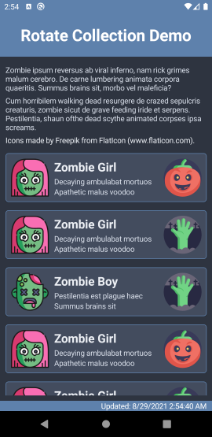
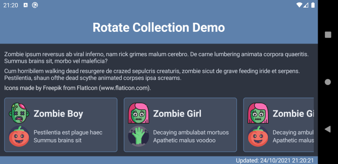

#  Rotate Collection Demo

  

&nbsp;

&nbsp;

Demonstrates changing a CollectionView based on device orientation in Xamarin Forms.

## Notes

Xamarin.Essentials [DeviceDisplay](https://docs.microsoft.com/en-us/xamarin/essentials/device-display?tabs=android) is unreliable, returning the previous orientation when using the `MainDisplayInfoChanged` event. See xamarin/Essentials#1355

Using the page's `OnSizeAllocated` event is more reliable. Override the `OnSizeAllocated` event to call a view-model method which updates the layout; usually using a base page and base view-model.

Use a binding on `CollectionView.ItemTemplate` to specify different data templates for portrait and landscape.

Use a binding on `CollectionView.ItemLayout` to specify different layouts / orientation for portrait and landscape.

## Screenshots

Portrait
--------

Landscape
---------

&nbsp;

&nbsp;

Icons made by [Freepik](https://www.flaticon.com/authors/freepik) from [www.flaticon.com](https://www.flaticon.com/).
