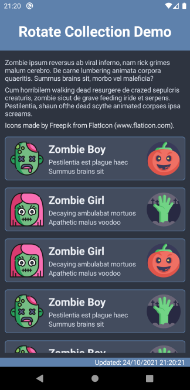

#  Rotate Collection Demo

  

&nbsp;

&nbsp;

Demonstrates changing a Xamarin Forms CollectionView from a vertical list to a horizontal list based on device orientation. This code accompanies my blog post [Rotating a list in Xamarin.Forms using CollectionView](https://blog.taranissoftware.com/rotating-a-list-in-xamarinforms-using-collectionview).

## Notes

Xamarin.Essentials [DeviceDisplay](https://docs.microsoft.com/en-us/xamarin/essentials/device-display?tabs=android) is unreliable, returning the previous orientation when using the `MainDisplayInfoChanged` event. See [xamarin/Essentials#1355](https://github.com/xamarin/Essentials/issues/1355).

Using the page's `OnSizeAllocated` event is more reliable, override the `OnSizeAllocated` event to call a view-model method which updates the layout. This is usually done using a base page but since this app has only one page the event is overridden in the code behind.

Uses a binding on `CollectionView.ItemTemplate` to specify different data templates for portrait and landscape orientation.

Uses a binding on `CollectionView.ItemLayout` to specify different layouts / orientation for portrait and landscape. On tablets multiple column layouts could be used instead.

## Screenshots

Portrait | Landscape
-------- | ---------
 | 

&nbsp;

Icons made by [Freepik](https://www.flaticon.com/authors/freepik) from [www.flaticon.com](https://www.flaticon.com/).

Text from [Zombie Ipsum](http://www.zombieipsum.com/).

Colours by [Nord](https://www.nordtheme.com/).
